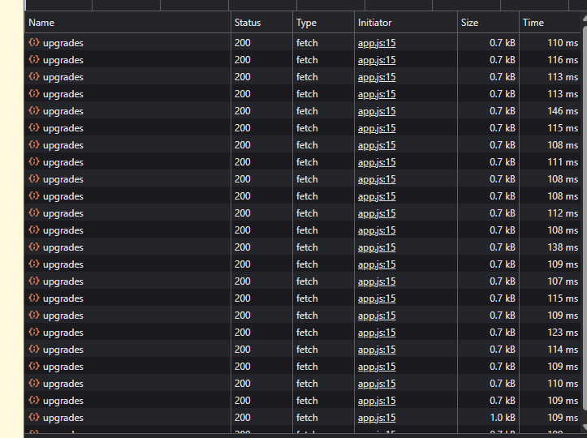

# Goals of the assignment

✅ ❌

## Basic Requirements:

✅ Fetch upgrade data from the provided API and at least one upgrade from the API update the cookie count.

✅ Ensure that functions are used effectively to keep code organised and reusable.

✅ Implement event listeners to handle user interactions.

✅ Use local storage to save and restore the cookie count and relevant game information.

✅ Use setInterval to increment the cookie count and manage the game state each second.
Managing the game state includes saving progress and updating the DOM.

## Stretch Goals:

✅ Consolidate upgrade management by managing all upgrades in a single function.

❌ Improve UX with animations, sound effects, or other visual effects.

❌ Fantastic use of README to provide important information such as a description of the project, how to deploy and other app information.

❌ Implement error handling using try/catch.

❌ Create a menu for users to adjust game options like sound effects or display preferences.

# Reflection

This weeks assignment was to create a cookie-clicker style game. I had some ideas going into this but due to the specific API data and goal requirements, I decided to pivot to a more traditional cookie clicker game, then add some flair in at the end if I had time. Below I'm going to talk about some specific aspects of the development process that I have thoughts about, or points I wanted to share.

## The Tooltip, and Design Principles!

In the original Cookie Clicker game, there is a feature that when you hover over an upgrade, you get a tooltip with some functional text as to what the upgrade is doing, and also some flavour text to go along with it.

One of the core design principles that I wanted was for the game to feel relaxed and minimalist. I really wanted to produce this tooltip to help with this design principle as it frees the screen up from information when you don't particularly need it.

To achieve the tooltip, I created a tooltip `
` for this information to be in. The initial idea was to have the tooltip be in a set place but would be annoying to hover over an upgrade, then have to divert your eyes elsewhere to read the tooltip, then back to the mouse cursor. Like other games i've played, tooltips generally appear at the mouse cursor and so I searched for ways to get my mouse position so that I could position my tooltip with absolute positioning - and I have to say, i'm very pleased with that and it works very well!

## Multiple Fetch Requests

**The Problem**
When implementing my hover tooltip, I decided that the best method I could take was to dynamically take the data from the API data, that way if the upgrades changed or more were added, the tooltip would be able to update regardless without the need to hard-code in some values.
I discovered a problem when I got the tooltip to work, in that it was slightly delayed when hovering. BEHOLD: DOZENS OF FETCH REQUESTS.

**Solution**
Every time I hovered an upgrade, it was fetching the data from the API. Because the speed of my tooltip updating was bottlenecked by the speed of the fetch, I decided that the best way to handle this would be to initially fetch the API data, then loop through the API array and push the values into my own local array, then use that new local array as my reference point.

This means that the fetch request only happens once on page load, and if changes are made to the API, all it would require is a page refresh -> the API would have new data -> new data is reflected in my local array (hopefully!).

# Resources:

[Get Mouse Position in Javascript](https://medium.com/@ryan_forrester_/how-to-get-mouse-position-in-javascript-37e4772a3f21)

[Try... catch](https://developer.mozilla.org/en-US/docs/Web/JavaScript/Reference/Statements/try...catch)
